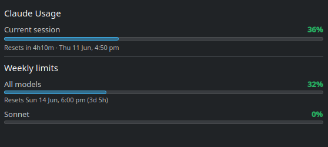

# Claude Usage — KDE Plasma 6 widget

A panel widget for KDE Plasma 6 that shows your current Claude session usage
and the reset timer, sourced from the **same official endpoint Claude Code's
`/usage` uses** (`https://api.anthropic.com/api/oauth/usage`).

- **In the panel:** session utilization `%` on top, time-to-reset (minutes) below,
  colour-coded green → orange → red at 70% / 90%.
- **Click → popup:** current 5-hour session plus **weekly limits** (all models,
  Opus, Sonnet) with bars and reset times.



## Layout

```
package/                          # the self-contained plasmoid
  metadata.json                   # id com.cbo.claudeusage, version, icon
  contents/
    ui/main.qml                   # UI + logic
    code/claude-usage.py          # Python helper, resolved at runtime (no
                                  # hardcoded paths — works on any machine)
install.sh                        # dev install: symlink + cache clear + restart
dist/                             # built .plasmoid packages
```

The helper ships **inside** the package, so the widget is fully self-contained
and distributable — nothing has to live in `~/.local/bin`.

## Install

For local development (live-edit):

```sh
./install.sh
```

This symlinks `package/` to `~/.local/share/plasma/plasmoids/com.cbo.claudeusage`,
so **editing files here edits the live widget**. Add it to a panel via
right-click → *Add Widgets* → "Claude Usage".

To build a distributable package:

```sh
./build.sh        # -> dist/claude-usage.plasmoid
```

Install a `.plasmoid` on any machine with
`kpackagetool6 -t Plasma/Applet -i dist/claude-usage.plasmoid` (or `-u` to
upgrade), or upload it to store.kde.org so it appears under
*Add Widgets → Get New Widgets*.

## How it gets the data

`contents/code/claude-usage.py` reads the OAuth access token from
`~/.claude/.credentials.json` and calls the usage endpoint. Claude Code keeps
that token fresh in normal use; if it expires (no Claude usage for a long
stretch) the call 401s and the widget shows "Sign in to Claude" until you next
run Claude Code. Standalone OAuth refresh is **not** implemented.

## Gotcha: the QML cache

Plasma serves a **compiled** copy of the QML from
`~/.cache/plasmashell/qmlcache/`. A plain plasmashell restart replays the cached
build, so source edits won't appear until that cache is cleared. `install.sh`
does this for you; if editing by hand, `rm -rf ~/.cache/plasmashell/qmlcache`
then restart plasmashell.
